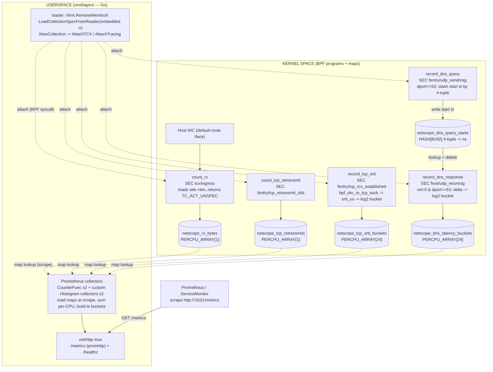

```mermaid
flowchart TB
    subgraph kernel["KERNEL SPACE (BPF programs + maps)"]
        direction TB
        nic["Host NIC (default-route iface)"]
        rxprog["count_rx<br/>SEC tcx/ingress<br/>reads skb->len, returns TC_ACT_UNSPEC"]
        retxprog["count_tcp_retransmit<br/>SEC fentry/tcp_retransmit_skb"]
        srttprog["record_tcp_srtt<br/>SEC fentry/tcp_rcv_established<br/>bpf_skc_to_tcp_sock -> srtt_us -> log2 bucket"]
        dnsqprog["record_dns_query<br/>SEC fentry/udp_sendmsg<br/>dport==53: stash start ts by 4-tuple"]
        dnsrprog["record_dns_response<br/>SEC fexit/udp_recvmsg<br/>ret>0 & dport==53: delta -> log2 bucket"]

        rxmap[("netscope_rx_bytes<br/>PERCPU_ARRAY[1]")]
        retxmap[("netscope_tcp_retransmits<br/>PERCPU_ARRAY[1]")]
        srttmap[("netscope_tcp_srtt_buckets<br/>PERCPU_ARRAY[24]")]
        dnsstarts[("netscope_dns_query_starts<br/>HASH[8192] 4-tuple -> ns")]
        dnsmap[("netscope_dns_latency_buckets<br/>PERCPU_ARRAY[24]")]

        nic --> rxprog --> rxmap
        retxprog --> retxmap
        srttprog --> srttmap
        dnsqprog -->|write start ts| dnsstarts
        dnsstarts -->|lookup + delete| dnsrprog
        dnsrprog --> dnsmap
    end

    subgraph user["USERSPACE (cmd/agent — Go)"]
        direction TB
        loader["loader: rlimit.RemoveMemlock<br/>LoadCollectionSpecFromReader(embedded .o)<br/>NewCollection -> AttachTCX / AttachTracing"]
        collectors["Prometheus collectors<br/>CounterFunc x2 + custom Histogram collectors x2<br/>read maps at scrape, sum per-CPU, build le buckets"]
        http["net/http mux<br/>/metrics (promhttp) + /healthz"]
    end

    scraper["Prometheus / ServiceMonitor<br/>scrape http://:9101/metrics"]

    loader -. "attach (BPF syscall)" .-> rxprog
    loader -. attach .-> retxprog
    loader -. attach .-> srttprog
    loader -. attach .-> dnsqprog
    loader -. attach .-> dnsrprog

    rxmap -.->|"map lookup (scrape)"| collectors
    retxmap -.->|map lookup| collectors
    srttmap -.->|map lookup| collectors
    dnsmap -.->|map lookup| collectors

    collectors --> http
    scraper -->|GET /metrics| http

    linkStyle default stroke-width:1px
```