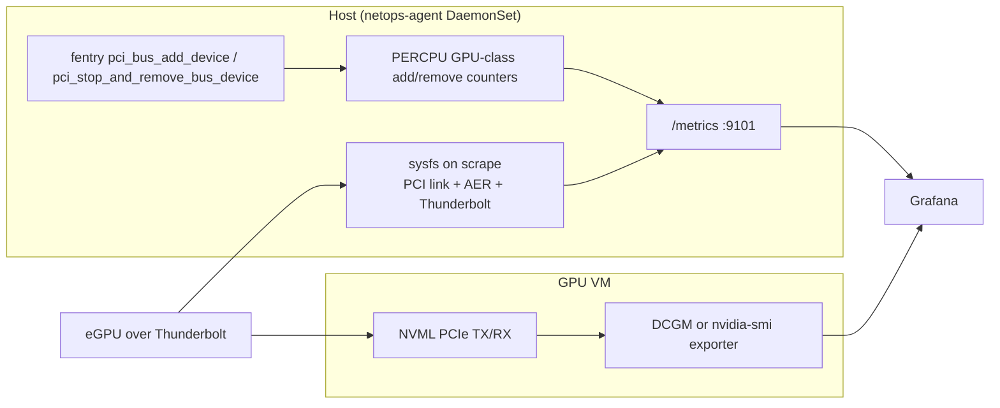

## Host Nic Observability

...

## Host PCI / Thunderbolt GPU fabric

The agent monitors the **host** path an eGPU takes onto the bus. It does not
report GPU PCIe byte counters: after VFIO passthrough, that DMA never hits
the host kernel. Run DCGM or `nvidia-smi` **inside the GPU VM** for
throughput, util, and VRAM.

## What is collected

| Metric | Source | Notes |
|---|---|---|
| `netops_pci_device_present` | sysfs | GPU-class functions only (`0x03xxxx` display, `0x12xxxx` accelerator). Stays `0` after unplug. |
| `netops_pci_link_speed_gtps` / `netops_pci_link_width` | sysfs | Negotiated link. Alert if below expected (e.g. not 8 GT/s × 4). |
| `netops_pci_link_speed_max_gtps` / `netops_pci_link_width_max` | sysfs | Advertised cap; compare to negotiated for retrains. |
| `netops_pci_aer_errors` | sysfs `aer_dev_*` | Omitted when AER files are absent. Snapshot of the status registers. |
| `netops_pci_probe_total` / `netops_pci_remove_total` | eBPF fentry | Optional. Agent still runs if attach fails. |
| `netops_thunderbolt_authorized` | sysfs | Enclosure authorization. |

Labels: `slot`, `vendor`, `device`, `driver` (PCI); `id`, `name` (Thunderbolt).

## Runtime

- `NETOPS_SYSFS` — sysfs root. Default `/sys`. The DaemonSet mounts host `/sys` at `/host/sys` and sets this to `/host/sys`.
- PCI BPF attach is best-effort. Sysfs gauges always register.

Guest bandwidth (out of scope here): `DCGM_FI_PROF_PCIE_TX_BYTES` / `DCGM_FI_PROF_PCIE_RX_BYTES` or NVML `nvmlDeviceGetPcieThroughput`.
