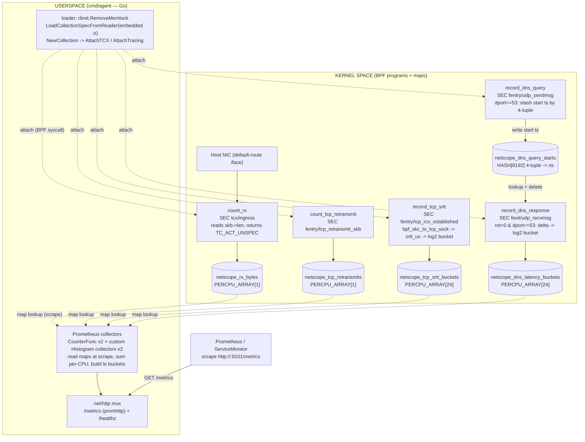

## HOST NIC Observability



## Host PCI Observability

An eGPU reaches a workload through a chain that crosses a VFIO passthrough
boundary, and **the boundary splits the observable signals in two**. Neither
side can see the other's.

```
eGPU enclosure ──TB──> Proxmox host ──vfio-pci──> QEMU ──> Talos guest ──> pod
                       ▲                                   ▲
                       │ real PCIe config space            │ synthesised config space
                       │ link / AER / Thunderbolt          │ presence only
                    role=host                           role=guest
```

On the hypervisor, sysfs exposes the real trained link, the AER status
registers, and the Thunderbolt bus. None of that reaches a guest. Inside the
VM, QEMU invents the passed-through function's PCIe capability — a healthy
card on `mlops-work-00` reports `current_link_speed = 0` against a max of 16,
and 63 lanes. Those are not measurements. The guest establishes exactly one
fact the host cannot: whether the device actually arrived in the VM.

So the agent runs in **both** places, with `NETOPS_ROLE` selecting what it may
honestly publish.

> **A Thunderbolt eGPU has no PCIe link to measure.** Verified on `pve2`: the
> endpoint and its parent bridge both return `EINVAL` for `current_link_speed`
> and `current_link_width`, and `Unknown` / `255` for the max attributes. The
> "link" is a Thunderbolt tunnel, not a trained PCIe link, so no link-quality
> telemetry exists on either side of the passthrough boundary. Link speed and
> width are only meaningful for a natively-slotted card. The collector suppresses
> these series whenever the kernel reports a sentinel rather than publishing
> `0 GT/s` and `255` lanes, which would read as a catastrophic degradation on
> healthy hardware.
>
> For an eGPU the load-bearing host-side signals are therefore
> `netops_thunderbolt_authorized`, `netops_pci_device_present`, and the
> probe/remove counters — enclosure dropped, device gone, device came back.

| Signal | `role=host` (Proxmox) | `role=guest` (Talos DaemonSet) |
|---|---|---|
| `netops_pci_device_present` | ✅ real bus | ✅ **the guest's unique contribution** |
| `netops_pci_link_speed_gtps` / `_width` | ⚠️ natively-slotted cards only | ❌ suppressed — QEMU fiction |
| `netops_pci_link_speed_max_gtps` / `_width_max` | ⚠️ natively-slotted cards only | ❌ suppressed |
| `netops_pci_aer_errors` | ✅ host kernel owns AER | ❌ never surfaced to a guest |
| `netops_thunderbolt_authorized` | ✅ only place the TB bus exists | ❌ no TB bus |
| `netops_pci_probe_total` / `_remove_total` | ✅ real hotplug | ✅ QEMU device add/remove |

### Why both — the discriminator

Running one side alone cannot separate the two most common failures, and they
have completely different fixes:

| host `present` | guest `present` | diagnosis |
|---|---|---|
| 1 | 1 | healthy |
| 1 | 0 | VFIO/QEMU binding — the GPU is on the bus, the VM never got it |
| 0 | 0 | physical — enclosure dropped, TB cable, power, link training |
| 0 | 1 | guest holding a zombie device; the VM needs a stop/start |

This mirrors the NIC design above, where `netops_rx_bytes_total` is anchored
before `cil_from_netdev` so it discriminates "packets arrived and Cilium
dropped them" from "packets never arrived". One signal on each side of a
boundary localises the fault; either one alone does not.

### Not covered

Throughput. After passthrough the GPU's DMA never touches the host kernel, so
no host-side counter can see it. Run DCGM or `nvidia-smi` **inside** the VM
that owns the card — on this cluster that is the `dcgm-exporter` DaemonSet
already scraping `mlops-work-00`. Guest bandwidth comes from
`DCGM_FI_PROF_PCIE_TX_BYTES` / `DCGM_FI_PROF_PCIE_RX_BYTES` or NVML
`nvmlDeviceGetPcieThroughput`.

## What is collected

| Metric | Source | Notes |
|---|---|---|
| `netops_pci_device_present` | sysfs | GPU-class functions (`0x03xxxx` display, `0x12xxxx` accelerator), excluding emulated adapters. Stays `0` after unplug. |
| `netops_pci_link_speed_gtps` / `netops_pci_link_width` | sysfs | `role=host`, and only when the kernel actually reports a link — absent for Thunderbolt-tunnelled devices. Compare against the max below; the absolute value alone is not a fault. |
| `netops_pci_link_speed_max_gtps` / `netops_pci_link_width_max` | sysfs | Same conditions. Advertised cap. |
| `netops_pci_aer_errors` | sysfs `aer_dev_*` | `role=host` only. Snapshot of the status registers, not a scrape counter — take deltas, expect a reset on reboot or driver rebind. Absent when AER files are. |
| `netops_pci_probe_total` / `netops_pci_remove_total` | eBPF fentry | Optional and **unlabelled** — they say a GPU-class function joined or left, never which. Pair with the slot whose `device_present` changed. Agent still runs if attach fails. |
| `netops_thunderbolt_authorized` | sysfs | `role=host` only. Enclosure authorization. |

Labels: `slot`, `vendor`, `device`, `driver` (PCI); `id`, `name` (Thunderbolt).

On a healthy passthrough host, `driver` reads `vfio-pci` — that is the expected
value, and it is worth alerting when it is not.

### Emulated adapters are filtered

Every QEMU/KVM guest presents a Bochs VGA adapter at `0x1234:0x1111` in display
class. It is indistinguishable from a real GPU by class alone, so a class-only
scan reports a "GPU" on every VM in the fleet and detects nothing. `ScanGPUs`
drops a denylist of virtual vendors — Bochs `0x1234`, virtio-gpu `0x1af4`,
VMware `0x15ad`, Cirrus `0x1013`, QXL `0x1b36`. A denylist rather than an
allowlist, so an unknown vendor is assumed real and new hardware is never
silently dropped.

This is also why node labels are the wrong gate. `nvidia.com/gpu.present`
comes from GPU Feature Discovery and requires the driver loaded and the device
plugin healthy — it disappears when the GPU falls off the bus or gets rebound
to `vfio-pci`, which is precisely when this telemetry matters. Detection is
done at runtime from sysfs instead: driver-independent, and it catches
Thunderbolt hotplug without waiting for a relabel and a pod reschedule.

## Runtime

- `NETOPS_SYSFS` — sysfs root. Default `/sys`. The DaemonSet mounts host `/sys` at `/host/sys` and sets this to `/host/sys`.
- `NETOPS_ROLE` — `host` or `guest`. Defaults to `host` (full fidelity, so a deployment that forgets to set it loses no data). The Helm chart sets `guest` via `pcie.role`.
- PCI BPF attach is best-effort. Sysfs gauges always register.

### Deploying the host side

The Proxmox hosts are not cluster members, so the `role=host` instance is not a
DaemonSet. Run the same static binary as a systemd unit on each hypervisor,
listening on `:9101`, and scrape it as a Prometheus static target.
